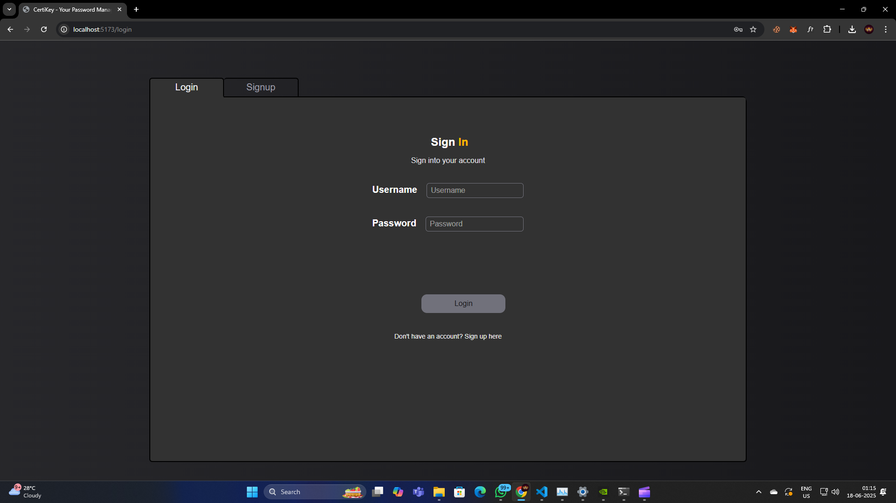
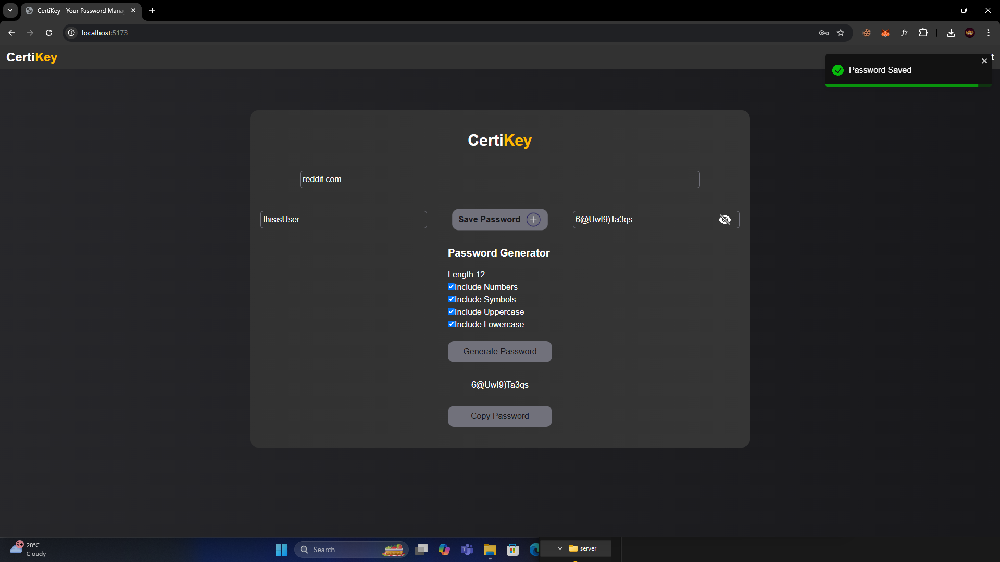
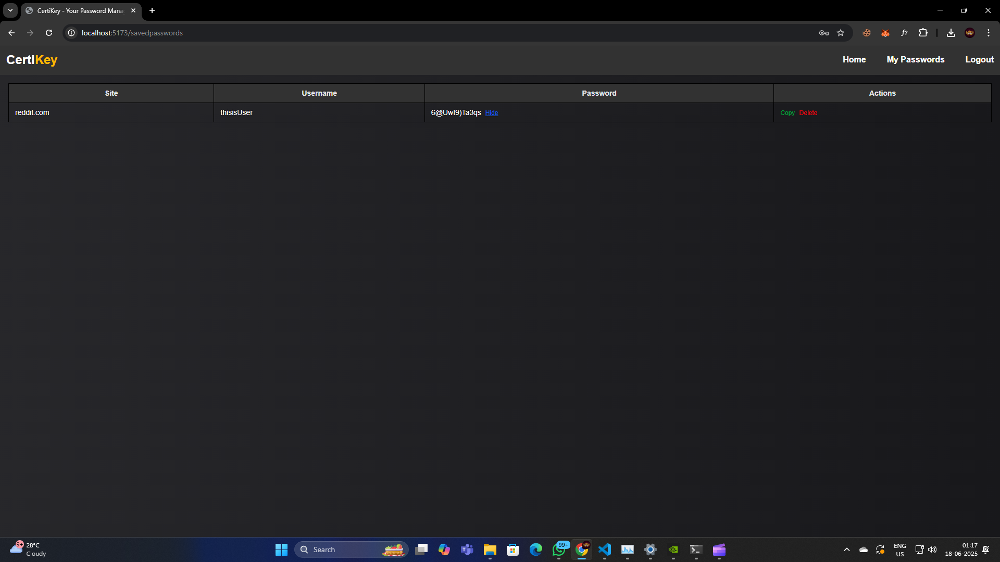

# 🔐 CertiKey – Password Manager (MERN Stack)

**CertiKey** is a full-stack password manager web application built using the **MERN stack** (MongoDB, Express.js, React, Node.js). It allows users to **securely store, manage, and delete** their saved passwords—all in a sleek and responsive UI.

---

## 🚀 Features

- 🔐 User authentication with Passport.js  
- 🧠 Secure password encryption and storage  
- ➕ Add, view, and delete stored credentials  
- 📱 Fully responsive React frontend  
- 🌐 RESTful API with Express & MongoDB  
- ☁️ Session-based login with cookie support

---

## 🛠️ Tech Stack

- **Frontend**: React, Tailwind CSS  
- **Backend**: Express.js, Node.js  
- **Database**: MongoDB (Mongoose)  
- **Authentication**: Passport.js + Express Sessions

---

## 📹 Demo Video

🎥 Watch how it works on YouTube:  
[▶️ Click here to watch the video](https://youtu.be/JVBFdUonq28)

---

## 🖼️ Screenshots

| Log In | Add Password | View Password |
|----------|--------------|----------------|
|  |  |  |

---

## 📂 Installation

1. **Clone the repository**
   ```bash
   git clone https://github.com/sidharthpandithar/CertiKey.git
   cd CertiKey
```

2. **Install dependencies for both frontend and backend**

   ```bash
   cd client && npm install
   cd ../server && npm install
   ```

3. **Set up your `.env` files**
   Create `.env` files in both `client` and `server` folders and add the required environment variables.

4. **Run the app**
   Use `concurrently` or separate terminals:

   ```bash
   npm run dev
   ```

---

## 📎 License

This project is open source under the [MIT License](LICENSE).

---

## 🙌 Contribution

Feel free to fork the repo and contribute.
Pull requests are welcome!

---

## 👋 Author

Made with ❤️ by [Sidharth Pandithar](https://github.com/sidharthpandithar)

```

